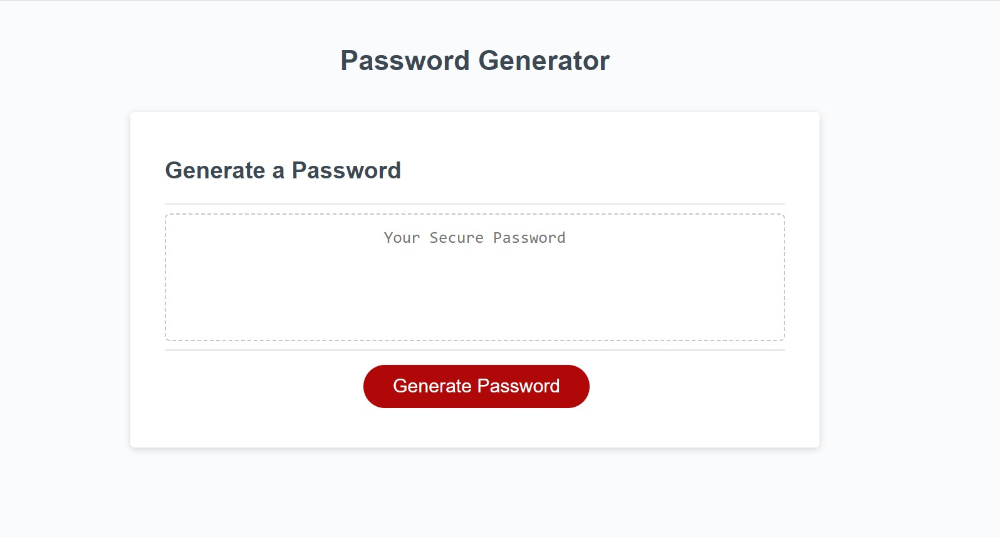

# Password Generator

## Description

Web page that helps the user generate a secure password at the click of a button.

Input is taken from the user on the password length they need (between 8 and 128 characters), then on the character types they would like the generated password to contain. 

Note: the password must contain at least one of the four character types:
 * Lowercase
 * Uppercase
 * Numeric
 * Special characters

Then, based on user input, the password is displayed in the dedicated field. 

### Visual 

## Installation
No installation needed. 

## Usage
The page can be accessed through the [following link](https://dsciocan.github.io/Password-Generator).

To begin, press the "Generate Password" button. This will trigger a series of prompts that need to be answered. 

Once the necessary information has been gathered, the password will show up in the "Your Secure Password" field. 

Pressing the "Generate Password" button again will restart the process. 

## Credits
Dataset from [Boot Camp Gitlab](https://git.bootcampcontent.com/uk-edx-16-week/UK-VIRT-FE-PT-09-2023-U-LOLC).

## License
License information is available in the [License](LICENSE) file.
